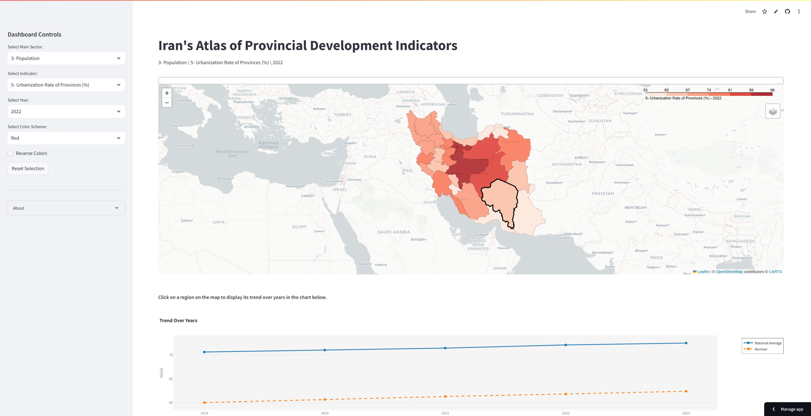

# Iran's Atlas of Provincial Development Indicators

**Overview**

The *Iran’s Atlas of Provincial Development Indicators* is an interactive web application built with [Streamlit](https://streamlit.io/) to visualize development indices across Iran’s provinces. Sourced from the *"Economic, Social, and Cultural Status of Provinces"* report by the Statistical Centre of Iran (SCI), it integrates geospatial data (`IRN_adm.json`) with statistical data (`IrDevIndex2.xlsx`) spanning 2019 to 2023. Covering 24 main categories—including education, population, and more—this dashboard provides a comprehensive tool for policymakers, researchers, and citizens to compare provincial development levels.

**Features**

- **Interactive Choropleth Map**
  - Customizable color schemes (Red, Blue, Green) with an option to reverse colors.
  - Styled tooltips on hover displaying province names and selected indicator values (e.g., "Index02-9").
  - Clickable provinces to highlight and update trend analysis.

- **Dynamic Controls**
  - Dropdowns to select main sectors (e.g., Education), sub-indicators, and years dynamically from the dataset.
  - Reset selection button to clear province highlights.
  - Loading spinner and warnings for missing data.

- **Trend Analysis**
  - Plotly line chart comparing national averages with province-specific trends over 2019–2023.
  - Updates dynamically when a province is clicked on the map.

- **Data Table**
  - Displays raw data for all provinces, including indicator values across years.
  - Responsive and scrollable for easy access.

- **Performance & Usability**
  - Cached GeoJSON and data loading for faster performance.
  - Responsive map height based on screen size.
  - Robust error handling for file uploads and data processing.

- **About Section**
  - Embedded within the app via an expander, detailing the dashboard’s purpose, data source, and a link to the full SCI report.

**Purpose**

Developed to support planning and policymaking, particularly for human development in less privileged regions, this dashboard leverages open-source statistical data from the SCI. The indicators—valid, reliable, and comparable—enable diverse analyses for inter-provincial comparisons and development goal tracking.

**Screenshots**

 *(Note: Update this with an actual screenshot if available)*

**Visit**

[Iran's Atlas of Provincial Development Indicators](https://iran-map-dashboard-askhiozygtwnii4szgafaf.streamlit.app/)

**Installation**

**Prerequisites**
- Python 3.8 or higher
- Virtual environment (recommended)

**Dependencies**
Install the required libraries using:
```bash
pip install streamlit pandas geopandas folium streamlit-folium plotly shapely
